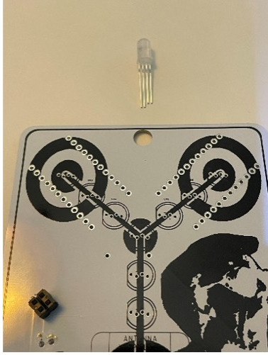
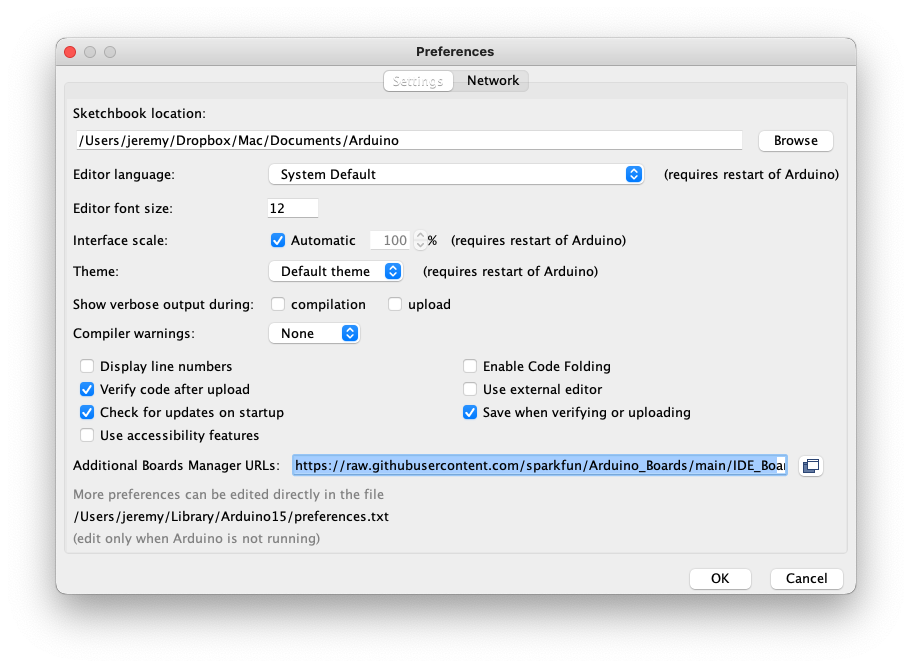
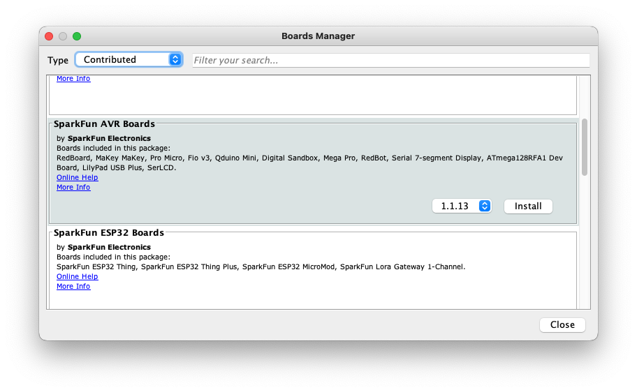
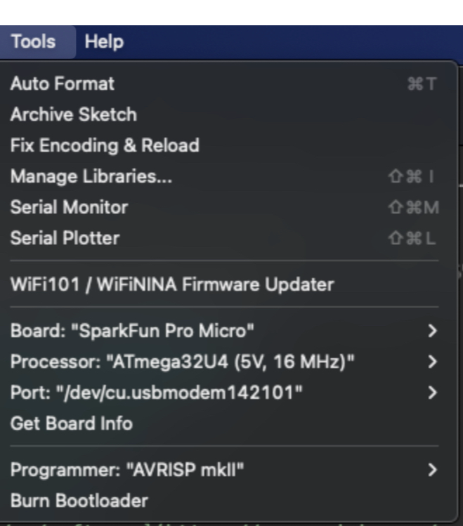
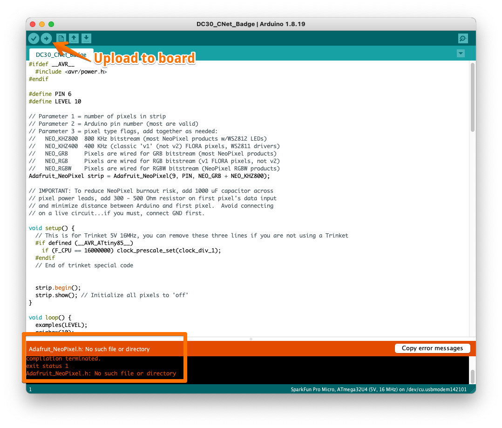
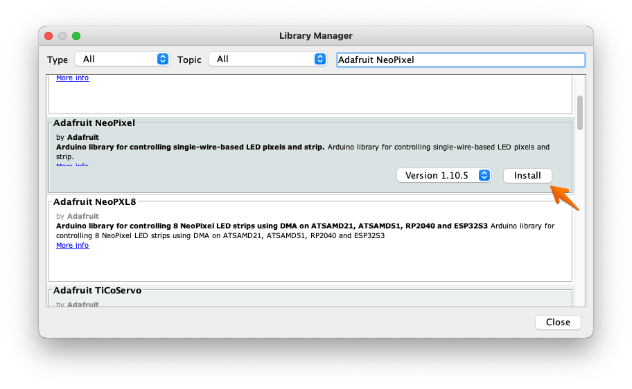

# Flux Capacitor LED Badge

## GitHub: [https://github.com/slash128v6/DC30\_CNet\_Badge](https://github.com/slash128v6/DC30_CNet_Badge)

### Parts List

**Main Badge**

- 1 main PCB (white)
- 1 foam pad
- 3 AAA batteries
- 1 battery carrier
- 2 Pro Micro
- 1 D1 Mini
- 1 jumper socket (four pin)
- 1 on/off switch
- 1 100ohm resistor
- 9 RGB LED (larger) F5-F
- 2 RGB LED (smaller - slow cycle) PN 1196
- 1 large static bag

**Mini Badge**

- 1 aux PCB (blue)
- 1 RGB LED (smaller - slow cycle) PN 1196
- 1 RGB LED (smaller - fast cycle) PN 1197 - behind cow
- 1 jumper header (four pin)
- 1 100ohm resistor
- 1 small static bag

# Instructions

## Main Badge

### Step 1: Verify the slow-cycling LEDs (mini-badge uses fast-cycling LED)

The main badge uses 9 large RGB LEDS (with four legs) and 2 smaller slow-cycling RGB LEDs. The mini-badge uses 1 slow-cycling LED and 1 fast-cycling LED that is identical in size and shape to the slow-cycling LEDs. You can verify that you are using the correct LED by testing with the battery pack. The fast-cycling RGB will change color very rapidly - if the colors change gradually, you're using the correct LEDs for the main badge. These LEDs are internally current limited so you can test by connecting it to the battery pack as shown with the longer lead to the left (+ or anode). Do not test regular LEDs like this, they will fry. Even though they don't need a resistor do not connect them backwards or they will fry. Set aside the fast-cycling LED. The other 3 are slow-cycling LEDs.

 

With the board upside down (silkscreen facing down), solder 2 of the slow-cycling rear LEDs on the back with short lead (- cathode) on the left side, and  flat facing label LED1 & LED2. Bend the LEDs so they are flat against the back of the board to shine through the translucent area on the PCB. Solder R1 on the back. Trim the leads on the front.

 

### Step 2: Solder the switch and female header

Solder the switch on the back

 

Flip the PCB over to the front and solder the SAO 4 pin female header on the front in position JP1

 

### Step 3: Install front RGD Leds

Install front RGB LEDs with long leads and flat on the left, matching the symbol on the board. Do not push all the way in, stop at the marks on the leads. Make sure there are no solder bridges. Trim the leads so there is clearance for the micro controllers to install on the other side.

 

### Step 4: Install the Pro Micros

Rear View – WiFi Duck Pro Micro is on the left, LED Pro Micro is on the right. Install with USB connector at the top and facing up away from the board. Install headers with long side facing away from the badge, black insulator between the micro and badge board. Make sure to solder all the pins on both the badge board and micro board.

 

### Step 5: Install the D1 Mini

Front View – D1 Mini. Install with reset button on the left and USB connector at the bottom facing down towards the board. Install headers with long side facing away from the badge, black insulator between the micro and badge board.

 

Trim a piece of double-sided foam tape to fit between the pins of the D1 Mini on back, then place battery holder on tape and solder the leads on the front

 

Slide switch to BATT for battery mode and USB when connecting to USB. Do not leave switch in BATT mode when USB power is connected.

## SAO: Mini-badge

Solder rear LEDs on the back with short lead and flat facing label LED1 & LED2. Bend the LEDs so they are flat against the back of the board to shine through the clear area on the PCB. The fast-cycling LED goes behind the surfing cow and the slow cycling LED goes behind the sun. Solder R1 on the back. Solder the male 4 pin header on the back. Trim the LED and resistor excess leads on the front.

 

Connect the SAO PCB to the main badge. Slide the switch to BATT and verify the small LEDs on the main badge and SAO all work.

 

## Badge LED Micro Programming

### Setting up the Arduino IDE

#### Download the Arduino IDE: 

[https://www.arduino.cc/en/software](https://www.arduino.cc/en/software)

Open Tools-> Board -> Boards Manager and select type "Contributed". If this is a new installation, you will likely not have "Sparkfun AVR Boards". Copy the following URL:

`https://raw.githubusercontent.com/sparkfun/Arduino_Boards/main/IDE_Board_Manager/package_sparkfun_index.json`

In the Arduino software, click on the Arduino menu and select "Preferences". Paste the URL in the field labled "Additional  Boards URL"

Open Tools-> Board -> Boards Manager and select type "Contributed". You should now see "Sparkfun AVR Boards" as an option. Click Install. Close Boards Manager when the install is complete.

**Now select the correct board: Tools -> Board -> Sparkfun AVR Boards -> Sparkfun Pro Micro**

**Select the correct processor: 5v, 16mhz**

Connect a data micro USB cable to the right Pro Micro on the back of the badge.

Download the LED Micro .ino file from the repo and open in Arduino: [https://github.com/slash128v6/DC30\_CNet\_Badge/blob/main/DC30\_CNet\_Badge/DC30\_CNet\_Badge.ino](https://github.com/slash128v6/DC30_CNet_Badge/blob/main/DC30_CNet_Badge/DC30_CNet_Badge.ino)

*Make sure you select the SparkFun Pro Micro from the SparkFun boards and Processor is the 5V, 16MHz version. If you select the 3V version and try to upload you’ll have to follow the recover process from SparkFun to unbrick it.*

**New Arduino installations will need to install the Neopixel library before the sketch updloads correctly.**

To install the missing Neopixal library, open Library Manager:

Sketch -> Include Library -> Manage Libraries

In the Library Manager, search for Adafruit Neopixel and click install:

With the Neopixel library installed, you should be able to upload the .ino file to the badge. Once uploaded, the LEDs on the front should start cycling. The front center RGB LED is for the WiFi Duck and does not light up with the other LEDs. See the WiFi Duck scripting documentation for use.

# WiFi Duck

The front center RGB LED is for the WiFi Duck and does not light up with the other LEDs. See the WiFi Duck scripting documentation for use.
The WiFi Duck uses the D1 Mini on the front and the Pro Micro on the back left side.

 

Follow the guide on the WiFi Duck GitHub for uploading firmware: https://github.com/SpacehuhnTech/WiFiDuck

**Make sure to use the correct board settings from the WiFi Duck boards and also make sure Debug is Disabled and Protocol is set to I2C for both the WiFi AVR Micro and D1 Mini. Neopixel on Pin 7.**

 

With the WiFi Duck powered by USB (either D1 Miini or Pro Micro) connect to WiFi network “wifiduck” with password “wifiduck” and open a browser window to http://192.168.4.1. Create a script called rickroll.script.

Paste the contents of rickroll.script file into the Editor, click Save and Enable Autorun.

With the USB cable connected to your PC and the WiFi Duck AVR Micro click the Run button and the script should run. With Autorun enabled the script should autorun when the USB connection is made.

